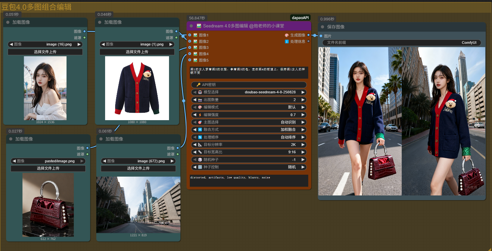
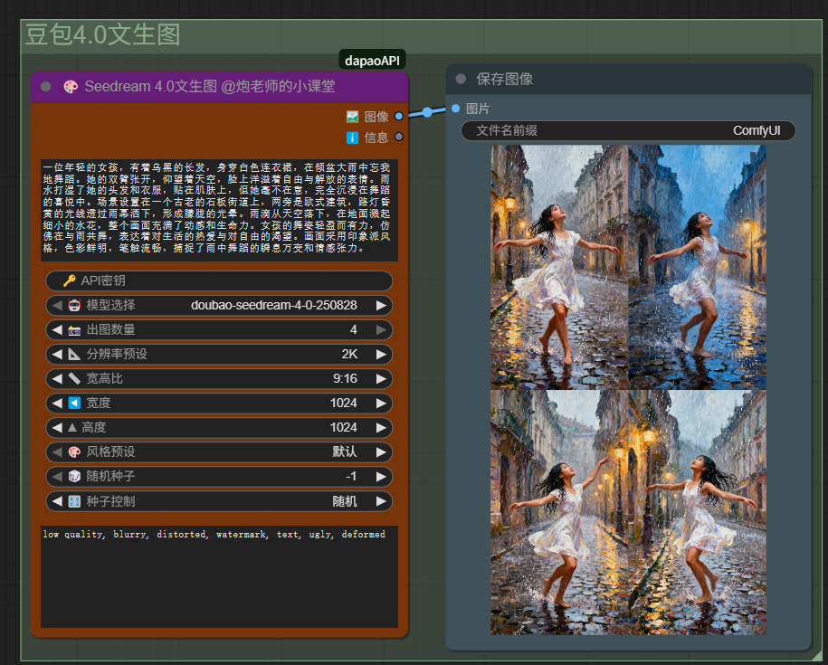
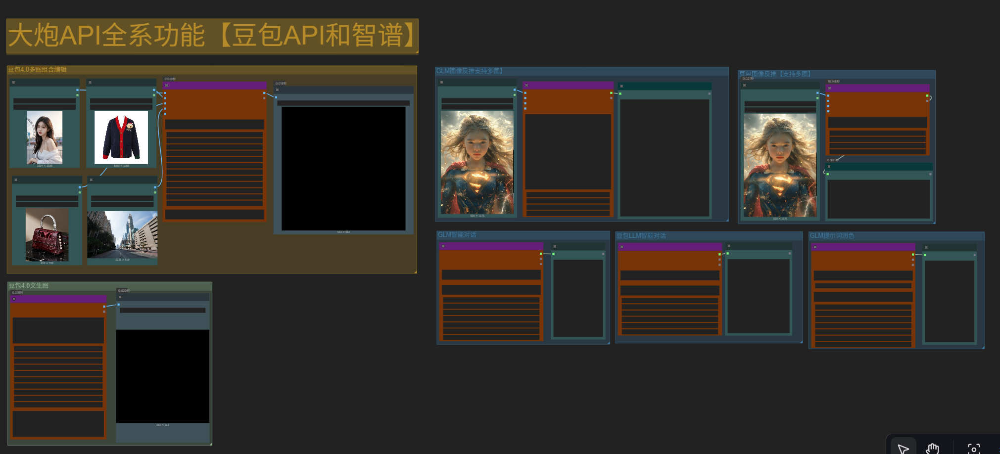

# 🤖 dapaoAPI - ComfyUI 多功能 API 节点集合

<div align="center">

**一套强大的 ComfyUI 自定义节点，集成多个主流 AI 服务 API**

[](https://opensource.org/licenses/MIT)
[](https://www.python.org/downloads/)
[](https://github.com/comfyanonymous/ComfyUI)

</div>

---

## 📖 项目简介

dapaoAPI 是一套为 ComfyUI 设计的高质量自定义节点集合，整合了 **火山引擎 Seedream 4.0**、**智谱 AI（GLM）** 和 **字节跳动豆包** 等主流 AI 服务，提供从图像生成、图像分析到文本处理的完整工作流支持。

### ✨ 核心特性

- 🎨 **图像生成**：Seedream 4.0 文生图 + 8种模式多图编辑
- 🔍 **图像分析**：GLM-4V / 豆包 Vision 多图联合智能反推提示词
- ✍️ **文本优化**：GLM-4 提示词智能润色与扩写
- 💬 **LLM 对话**：豆包/智谱双引擎智能对话系统
- 🎛️ **统一界面**：紫色主题，优雅易用
- ⚙️ **灵活配置**：种子控制、批量生成、自定义参数

---

## 📦 节点列表

| 节点名称 | 功能描述 | 核心特性 | 文档链接 |
|---------|---------|---------|---------|
| **Seedream 4.0 文生图** | 文本生成高质量图像 | 多风格预设、批量生成、种子控制 | [📖 使用说明](docs/1-Seedream文生图使用说明.md) |
| **Seedream 4.0 多图编辑** | 强大的多图编辑工具 | 8种编辑模式、最多8图输入、智能混合 | [📖 使用说明](docs/2-Seedream多图编辑使用说明.md) |
| **GLM 图像反推** | 图像内容智能分析 | 多图联合分析、多种输出格式 | [📖 使用说明](docs/3-GLM图像反推使用说明.md) |
| **GLM 提示词润色** | 提示词智能优化 | 3种预设方案、自定义指令 | [📖 使用说明](docs/4-GLM提示词润色使用说明.md) |
| **豆包 LLM 对话** | 字节跳动大语言模型 | 快速响应、通用对话 | [📖 使用说明](docs/5-豆包LLM对话使用说明.md) |
| **豆包图像反推** | 豆包 Vision 图像分析 | 多图联合分析、英文提示词生成 | [📖 使用说明](docs/7-豆包图像反推使用说明.md) |
| **智谱 LLM 对话** | 智谱 AI 大语言模型 | 深度中文理解、专业内容 | [📖 使用说明](docs/6-智谱LLM对话使用说明.md) |

---
## 效果演示
🚀 豆包4.0多图组合

🚀 豆包4.0文生图

🚀 其他功能（提示词润色 反推 大语言润色等）


🚀 全系功能演示在示意工作流里面，节点安装后在examples文件夹内


## 🚀 快速开始

### 环境要求

- **ComfyUI**：已安装并能正常运行
- **Python**：3.8 或更高版本
- **依赖库**：requests、zhipuai（自动安装）

### 安装方法

#### 方法一：ComfyUI Manager（推荐）

1. 打开 ComfyUI Manager
2. 搜索 "dapaoAPI"
3. 点击安装
4. 重启 ComfyUI

#### 方法二：Git 克隆

```bash
cd ComfyUI/custom_nodes/
git clone https://github.com/paolaoshi/ComfyUI-dapaoAPI.git
cd ComfyUI-dapaoAPI
pip install -r requirements.txt
```

#### 方法三：手动下载

1. 下载本项目的 ZIP 文件
2. 解压到 `ComfyUI/custom_nodes/ComfyUI-dapaoAPI`
3. 运行 `install.bat`（Windows）或 `pip install -r requirements.txt`

### 首次配置

安装后需要配置 API 密钥才能使用：

#### 1. Seedream 4.0 配置

编辑 `config.json`：

```json
{
    "api_key": "你的Seedream API密钥",
    "endpoint_id": "你的端点ID",
    "base_url": "https://ark.cn-beijing.volces.com/api/v3",
    "timeout": 120
}
```

#### 2. 智谱 AI 配置

编辑 `glm_config.json`：

```json
{
    "api_key": "你的智谱AI密钥",
    "model": "GLM-4.5-Flash",
    "timeout": 60
}
```

#### 3. 豆包配置

编辑 `doubao_config.json`：

```json
{
    "doubao_api_key": "你的豆包API密钥",
    "doubao_base_url": "https://ark.cn-beijing.volces.com/api/v3",
    "doubao_vision_endpoint": "doubao-seed-1-6-vision-250815",
    "timeout": 120
}
```

> **提示**：也可以在节点中直接输入 API Key，无需修改配置文件。

---

## 🔑 API 密钥获取

### Seedream 4.0（火山引擎）

1. 访问 [火山引擎控制台](https://console.volcengine.com/ark)
2. 创建 API Key
3. 创建推理端点并获取 Endpoint ID

**文档**：https://www.volcengine.com/docs/82379

### 智谱 AI

1. 访问 [智谱 AI 开放平台](https://open.bigmodel.cn/)
2. 注册并登录
3. 前往 [API Keys 页面](https://open.bigmodel.cn/usercenter/apikeys)
4. 创建并复制 API Key

**文档**：https://open.bigmodel.cn/dev/api

### 豆包（字节跳动）

1. 访问 [火山引擎豆包页面](https://console.volcengine.com/ark)
2. 开通豆包服务
3. 创建 API Key

**文档**：https://www.volcengine.com/docs/82379

---

## 💡 使用示例

### 示例 1：AI 绘画完整工作流

```
1. 使用"GLM 提示词润色"优化您的初始想法
   输入：一只猫
   输出：详细的优化提示词

2. 使用"Seedream 4.0 文生图"生成图像
   输入：优化后的提示词
   输出：高质量图像

3. 使用"豆包图像反推"或"GLM 图像反推"分析生成的图像
   输入：生成的图像
   输出：详细的图像描述
```

### 示例 2：图像风格迁移

```
1. 准备原始图片和风格参考图
2. 使用"Seedream 4.0 多图编辑"
3. 选择"风格参考"模式
4. 输入提示词描述期望效果
5. 获得风格迁移后的图像
```

### 示例 3：批量图像生成

```
1. 使用"GLM LLM 对话"生成多个提示词变体
2. 使用"Seedream 4.0 文生图"
3. 设置：
   - 出图数量：4
   - 种子控制：递增
4. 一次生成4张渐进变化的图像
```

### 示例 4：图像修复与优化

```
1. 加载需要修复的图像
2. 创建遮罩标记修复区域
3. 使用"Seedream 4.0 多图编辑"
4. 选择"局部重绘"模式
5. 获得修复后的图像
```

---

## 🎨 节点详细功能

### 🖼️ Seedream 4.0 文生图

#### 核心功能
- ✅ 文本描述生成图像
- ✅ 6种风格预设（写实、动漫、2.5D等）
- ✅ 分辨率灵活控制（512-2048px）
- ✅ 批量生成（1-4张）
- ✅ 种子控制（固定/随机/递增）
- ✅ 负向提示词支持

#### 典型应用
- AI 艺术创作
- 产品概念图设计
- 角色设定生成
- 场景原画创作

[📖 查看完整文档](docs/1-Seedream文生图使用说明.md)

---

### 🎭 Seedream 4.0 多图编辑

#### 8种编辑模式

| 模式 | 功能 | 适用场景 |
|------|------|----------|
| **即梦** | 多图智能混合 | 创意合成、概念设计 |
| **图生图** | 基于参考图生成 | 风格转换、内容变化 |
| **局部重绘** | 修复/替换局部 | 瑕疵修复、内容替换 |
| **扩展图像** | 画面边界扩展 | 背景延伸、画面补全 |
| **风格参考** | 风格提取应用 | 风格迁移、艺术化 |
| **相似图生成** | 生成相似变体 | 设计迭代、多方案 |
| **图像混合** | 精确混合控制 | 艺术创作、融合效果 |
| **创意填充** | 智能内容补全 | 缺失修复、创意延伸 |

#### 高级特性
- 最多8张图片输入
- 主图智能指定
- 4种混合模式
- 编辑强度调节（0.0-1.0）
- 批量生成（1-4张）

[📖 查看完整文档](docs/2-Seedream多图编辑使用说明.md)

---

### 🔍 GLM 图像反推

#### 核心功能
- ✅ 单图/多图深度分析（最多4张）
- ✅ 智能提示词生成
- ✅ 4种详细程度（简洁/标准/详细/极致）
- ✅ 4种输出格式（提示词/描述/结构化/JSON）
- ✅ 自定义分析角度

#### 典型应用
- AI绘画提示词反推
- 图像风格学习
- 摄影构图分析
- 多图对比分析

#### 模型选择
- **GLM-4V-Flash**：速度快，日常使用
- **GLM-4V-Plus**：质量高，专业分析
- **GLM-4V**：标准版，平衡性能

[📖 查看完整文档](docs/3-GLM图像反推使用说明.md)

---

### ✍️ GLM 提示词润色

#### 核心功能
- ✅ 智能提示词扩写
- ✅ 3种预设优化方案
- ✅ 自定义优化指令（优先级最高）
- ✅ 长度智能控制
- ✅ 种子控制

#### 预设方案

1. **即梦文生图**（默认）
   - 通用AI绘画优化
   - 丰富画面细节
   - 添加专业术语

2. **即梦多图编辑**
   - 强调图像融合
   - 突出风格统一
   - 描述元素关系

3. **Wan2.2视频扩写**
   - 动态场景描述
   - 镜头运动说明
   - 时间序列刻画

#### 自定义优先级
```
自定义指令 > 预设方案 > 默认方案
```

[📖 查看完整文档](docs/4-GLM提示词润色使用说明.md)

---

### 💬 豆包 LLM 对话

#### 核心功能
- ✅ 智能对话与问答
- ✅ 文本创作与改写
- ✅ 代码生成与调试
- ✅ 内容总结提取
- ✅ 角色扮演
- ✅ 系统提示词自定义

#### 模型
- **doubao-seed-1-6-251015**：最新版本，综合能力强

#### 典型应用
- 日常对话问答
- 文章创作辅助
- 代码生成
- 内容翻译润色
- 头脑风暴

[📖 查看完整文档](docs/5-豆包LLM对话使用说明.md)

---

### 🔍 豆包图像反推

#### 核心功能
- ✅ 单图/多图深度分析（最多4张）
- ✅ 智能英文提示词生成
- ✅ 自定义反推指令
- ✅ 种子控制（固定/随机/递增）
- ✅ 多图对比分析

#### 典型应用
- AI绘画提示词反推
- 图像内容理解
- 多图关联分析
- 图像对比分析
- 风格特征提取

#### 模型
- **doubao-seed-1-6-vision-250815**：豆包视觉模型，识别准确

#### 特色功能
- 完整64位种子支持
- 多图联合分析
- 自定义分析角度
- 中英文双语输出

[📖 查看完整文档](docs/7-豆包图像反推使用说明.md)

---

### 🧠 智谱 LLM 对话

#### 核心功能
- ✅ 深度中文理解
- ✅ 专业内容创作
- ✅ 逻辑推理分析
- ✅ 代码生成调试
- ✅ 学术写作支持
- ✅ 系统提示词自定义

#### 模型选择

| 模型 | 特点 | 推荐场景 |
|------|------|----------|
| **GLM-4.5-Flash** ⭐ | 速度最快，性价比高 | 日常使用 |
| **GLM-4-Plus** | 能力最强，深度理解 | 专业需求 |
| **GLM-4-Air** | 平衡版本 | 通用场景 |
| **GLM-4-Flash** | 快速响应 | 实时对话 |

#### 典型应用
- 学术论文写作
- 深度问题解答
- 数据分析报告
- 教学辅导
- 专业内容生成

[📖 查看完整文档](docs/6-智谱LLM对话使用说明.md)

---

## 🎯 种子控制说明

所有节点都支持3种种子控制方式：

| 控制方式 | 说明 | 适用场景 |
|----------|------|----------|
| **随机** | 每次生成使用随机种子 | 探索多样化结果 |
| **固定** | 使用指定的固定种子值 | 复现特定结果、A/B测试 |
| **递增** | 种子值自动递增 | 批量生成连续变化 |

### 使用技巧

#### 固定种子的应用
```
场景：微调提示词，对比效果
设置：seed_control=固定，seed=12345
效果：在相同种子下测试不同提示词
```

#### 递增种子的应用
```
场景：批量生成角色设定
设置：seed_control=递增
效果：生成一系列相关但不同的角色图
```

---

## 🎨 统一界面主题

所有节点采用统一的紫色主题，易于识别和使用：

- 🎨 **标题栏颜色**：紫色（#631E77）
- 🎨 **节点背景**：橙棕色（#773508）
- 📁 **节点分类**：🤖dapaoAPI
- 💡 **设计理念**：简洁、优雅、专业

---

## ⚙️ 配置文件说明

项目包含3个配置文件，对应不同的API服务：

### config.json - Seedream 配置
```json
{
    "api_key": "Seedream API密钥",
    "endpoint_id": "推理端点ID",
    "base_url": "https://ark.cn-beijing.volces.com/api/v3",
    "timeout": 120
}
```

### glm_config.json - 智谱AI配置
```json
{
    "api_key": "智谱AI密钥",
    "model": "GLM-4.5-Flash",
    "timeout": 60
}
```

### doubao_config.json - 豆包配置
```json
{
    "api_key": "豆包API密钥",
    "base_url": "https://ark.cn-beijing.volces.com/api/v3",
    "timeout": 60,
    "endpoints": {
        "doubao-seed-1-6-vision-250815": "Seed-1.6 Vision"
    }
}
```

> **安全提示**：请勿将包含真实API密钥的配置文件提交到公开仓库！

---

## 📁 项目结构

```
ComfyUI-dapaoAPI/
│
├── __init__.py                    # 节点注册入口
├── seedream_nodes.py              # Seedream节点实现
├── glm_nodes.py                   # GLM节点实现
├── doubao_chat_node.py            # 豆包LLM节点
├── zhipu_chat_node.py             # 智谱LLM节点
│
├── config.json                    # Seedream配置
├── glm_config.json                # GLM配置
├── doubao_config.json             # 豆包配置
│
├── glm_optimization_templates/    # GLM优化模板目录
│   ├── 即梦文生图扩写.txt
│   ├── 即梦多图编辑.txt
│   └── wan2.2视频扩写.txt
│
├── web/                           # Web资源
│   └── appearance.js              # 节点样式定义
│
├── docs/                          # 文档目录
│   ├── 1-Seedream文生图使用说明.md
│   ├── 2-Seedream多图编辑使用说明.md
│   ├── 3-GLM图像反推使用说明.md
│   ├── 4-GLM提示词润色使用说明.md
│   ├── 5-豆包LLM对话使用说明.md
│   └── 6-智谱LLM对话使用说明.md
│
├── requirements.txt               # Python依赖
├── install.bat                    # Windows安装脚本
└── README.md                      # 本文件
```

---

## ❓ 常见问题

### 1. 节点没有显示在菜单中

**解决方法**：
- 检查是否正确安装了依赖：`pip install -r requirements.txt`
- 重启 ComfyUI
- 查看控制台是否有错误信息

### 2. API 调用失败

**可能原因**：
- API Key 未配置或错误
- 网络连接问题
- API 额度不足
- Endpoint ID 错误（Seedream）

**解决方法**：
- 检查配置文件中的API Key是否正确
- 测试网络连接
- 登录对应平台查看额度
- 确认Endpoint ID有效

### 3. GLM 节点加载失败

**原因**：`zhipuai` 库未安装

**解决方法**：
```bash
pip install zhipuai
```

### 4. 生成速度很慢

**可能原因**：
- 图片分辨率过高
- 推理步数设置过多
- 网络延迟

**优化建议**：
- 降低分辨率或步数进行测试
- 使用"Flash"系列模型（速度更快）
- 检查网络质量

### 5. 种子控制不生效

**说明**：
- 不同模型对种子的处理方式可能不同
- 相同种子不保证100%相同结果
- 模型更新可能影响输出

### 6. 智谱AI种子值错误

**原因**：智谱AI种子值范围限制（1-2147483647）

**解决**：节点会自动映射超出范围的种子值


---

---

## 📄 许可证

本项目采用 [MIT License](LICENSE) 开源。

---

## 🙏 致谢

感谢以下服务提供商：
- [火山引擎](https://www.volcengine.com/) - Seedream 4.0 & 豆包
- [智谱AI](https://open.bigmodel.cn/) - GLM-4 系列模型
- [ComfyUI](https://github.com/comfyanonymous/ComfyUI) - 优秀的节点化AI工作流框架

---

## 📞 联系方式

- **作者**：@炮老师的小课堂
- **版本**：v1.0.1
- **更新日期**：2025年
- **作者微信**：paolaoshiAICG

---

## 🌟 支持项目

如果这个项目对您有帮助，请给个 ⭐ Star！

有任何问题或建议，欢迎提交 Issue 或 PR。

---

<div align="center">

**Happy Creating with dapaoAPI! 🎨✨**

</div>
