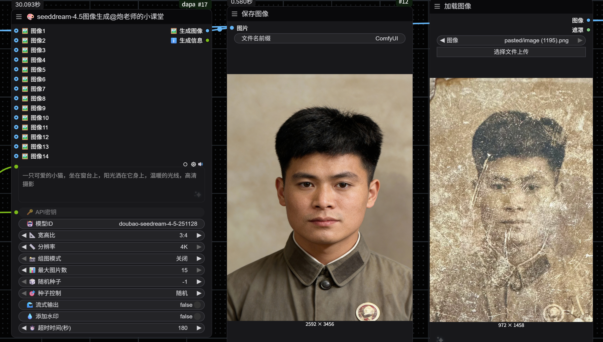
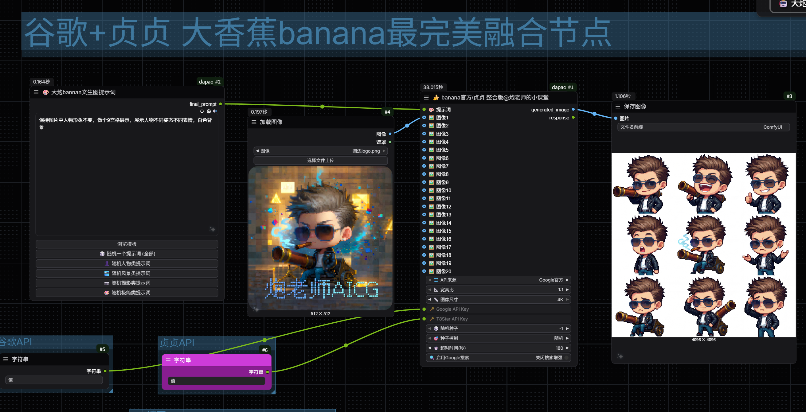
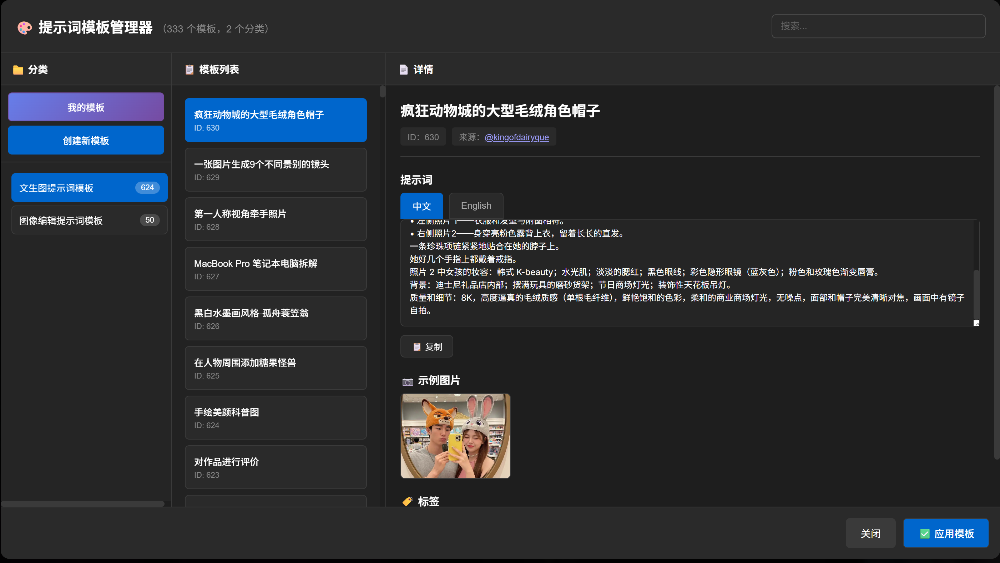
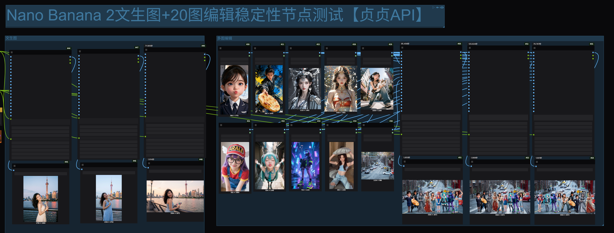
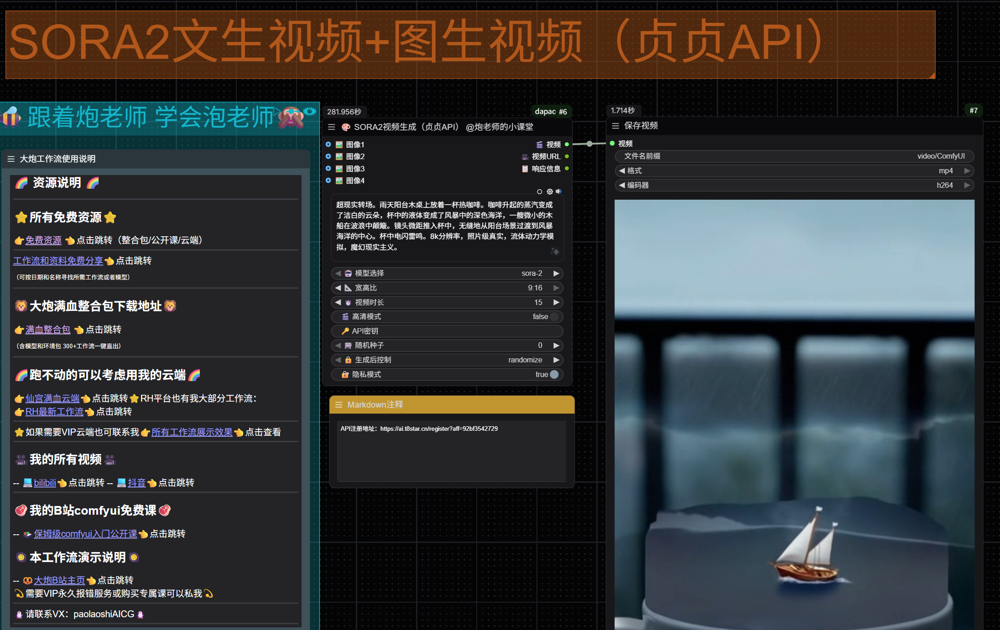
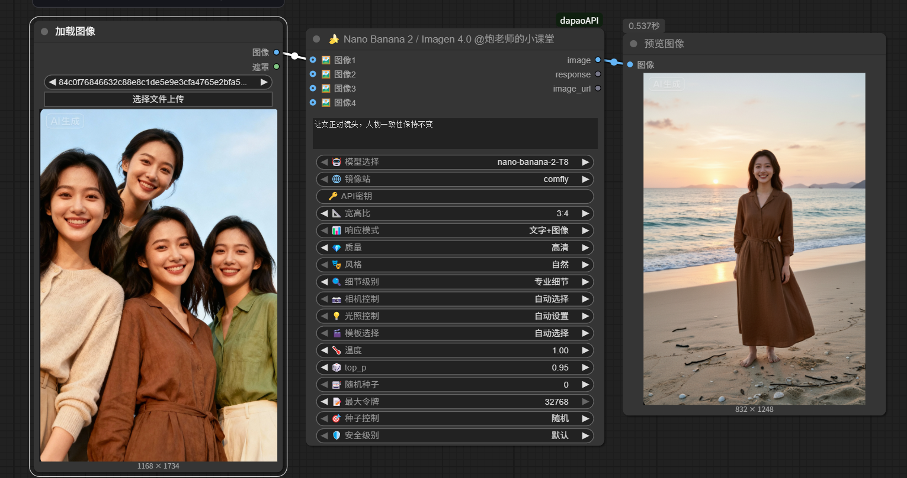

# 🤖 dapaoAPI - ComfyUI 多功能 API 节点集合

<div align="center">

**一套强大的 ComfyUI 自定义节点，集成多个主流 AI 服务 API**

[](https://opensource.org/licenses/MIT)
[](https://www.python.org/downloads/)
[](https://github.com/comfyanonymous/ComfyUI)

</div>

---

## 📖 项目简介

dapaoAPI 是一套为 ComfyUI 设计的高质量自定义节点集合，整合了各种主流 AI 服务，提供从图像生成、图像分析到文本处理的完整工作流支持。

---
## 🎉 更新说明：
## 🎿贞贞API注册地址：👉[贞贞API官方注册地址（一键直达）](https://ai.t8star.cn/register?aff=92bf3542729)👈

### 🚀 2025-12-17 新增dream4.5节点，文生图，图生图，图像编辑，豆包小香蕉~！


### 🚀 2025-12-6 节点大减肥！
删掉之前一些重复节点，节点做了分类整理，并增加了banban2 分组，文生图图生图智能切换，官方+贞贞真4K模型支出！【在示例工作流内有】

### 🚀 2025-12-04 新增bannan2 提示词模板库，内置优质提示词，含文生图和图像编辑 支持自定义 或随机提示词

### 🚀 2025-12-04 新增bannan2 官方/贞贞稳定合一节点 支持文生图+图像编辑 支持4K直出 增加20图编辑 放入bannan2分组内

### 🚀 2025-11-29 新增bannan2 贞贞专区 稳定IP 增加20图编辑 保证出图稳定 支持文生图 图像编辑

### 🚀 2025-11-25 增加视频/音频反推功能


### 🚀 2025-11-24 重大更新！通用 API 节点发布

**新增两大核心节点，支持任意第三方和官方 API 调用！**

#### ✨ 核心特性
- 🌐 **通用 API 调用节点**：支持任意 HTTP API（OpenAI、Claude、Gemini 等）
- 🎨 **通用图像编辑节点**：专为图像生成和编辑优化
- 🔄 **智能适配**：自动识别 Gemini 官方 API，优先使用 SDK
- 🛡️ **优雅降级**：SDK 失败自动回退到 REST API
- 🎯 **零破坏性**：完全兼容现有第三方 API


*多模态对话 - 支持官方和第三方 API*


*多图编辑 - Nano Banana 2 官方+第三方调用*


*SORA2 视频生成 - 支持文生视频和图生视频*

### 🚀 2025-11-21 更新

**Nano Banana 2 节点发布！**
- 🍌 Google 多模态图像生成
- 🎨 文生图 + 多图编辑
- 🎭 13种专业模板


🚀 豆包4.0多图组合

🚀 豆包4.0文生图

🚀 其他功能（提示词润色 反推 大语言润色等）


🚀 豆包4.0视频反推

🚀 全系功能演示在示意工作流里面，节点安装后在examples文件夹


## 🚀 快速开始

### 环境要求

- **ComfyUI**：已安装并能正常运行
- **Python**：3.8 或更高版本
- **依赖库**：requests、zhipuai（自动安装）

### 安装方法

#### 方法一：ComfyUI Manager（推荐）

1. 打开 ComfyUI Manager
2. 搜索 "dapaoAPI"
3. 点击安装
4. 重启 ComfyUI

#### 方法二：Git 克隆

```bash
cd ComfyUI/custom_nodes/
git clone https://github.com/paolaoshi/ComfyUI-dapaoAPI.git
cd ComfyUI-dapaoAPI
pip install -r requirements.txt
```

---

## 📦 节点列表

### � Seedream 4.5 节点（v1.4.0 新增）

| 节点名称 | 功能描述 | 核心特性 | 适用场景 |
|---------|---------|---------|---------|
| **🎨 seeddream-4.5图像生成@炮老师的小课堂** | 火山引擎最新图像生成模型 | • 文生图/单图生图/多图融合<br>• 组图生成（最多15张）<br>• 支持2-14张参考图输入<br>• 2K/4K高分辨率<br>• 流式输出模式<br>• 种子控制（固定/随机/递增） | • 高质量图像生成<br>• 多图融合创作<br>• 连续故事板生成<br>• AI水印可选 |

**功能亮点：**
- 📝 **文生图**：根据文本提示词生成高质量图像
- 🖼️ **单图生图**：基于单张参考图生成变体
- 🎨 **多图融合**：支持2-14张参考图智能融合
- 📸 **组图生成**：自动生成一组内容关联的图片
- 📐 **灵活尺寸**：支持2K/4K预设或自定义像素值（总像素3.7M-16.8M）
- 🌊 **流式输出**：实时查看生成进度
- 💧 **水印控制**：可选择是否添加AI生成水印

### �🆕 通用节点（v1.1.0 新增）

| 节点名称 | 功能描述 | 核心特性 | 适用场景 |
|---------|---------|---------|---------||
| **🌐 通用API调用（测试）** | 支持任意HTTP API调用 | • 自动适配官方/第三方API<br>• 支持多模态输入<br>• 智能SDK切换<br>• 完整错误处理 | • OpenAI API<br>• Claude API<br>• Gemini 官方API<br>• 任意第三方API |
| **🎨 通用图像编辑API** | 专为图像生成优化 | • 多图编辑支持<br>• 智能放大功能<br>• 官方SDK集成<br>• 多种端点适配 | • Gemini 图像生成<br>• Nano Banana 2<br>• 图像编辑API |
| **🎬 SORA2视频生成** | OpenAI SORA2视频生成 | • 文生视频+图生视频<br>• 多图输入（最多4张）<br>• 异步任务轮询<br>• 进度实时显示 | • 文本生成视频<br>• 图像转视频<br>• 创意视频制作 |

## 🌐 通用 API 节点使用指南

### 🎯 节点特点

**🌐 通用API调用（测试）节点** 是一个强大的通用接口，可以调用任何符合标准的 HTTP API。

#### ✨ 核心优势

1. **智能适配**
   - 自动检测 Gemini 官方 API
   - 优先使用官方 SDK（更稳定、更快）
   - SDK 失败自动回退到 REST API

2. **多模态支持**
   - 📸 最多 4 张图像输入
   - 🎬 视频输入（自动采样关键帧）
   - 🎵 音频输入
   - 💬 文本对话

3. **灵活配置**
   - 自定义 API 地址
   - 自定义请求头和参数
   - 超时时间控制（默认 180 秒）
   - 响应数据提取

### 📝 配置示例

#### 示例 1：Gemini 官方 API

```
🎯 系统角色: 你是一个专业的图像分析师
💬 用户输入: 请分析这张图片的内容
🤖 模型名称: gemini-2.0-flash-exp
🌐 API地址: https://generativelanguage.googleapis.com
🔑 API密钥: 你的 Gemini API Key
📡 请求方法: POST
🔐 密钥位置: Header
📝 密钥字段名: x-goog-api-key
⏱️ 超时时间: 180
```

#### 示例 2：第三方 API（Nano Banana 2）

```
💬 用户输入: 让女正对镜头，人物一致性保持不变
🤖 模型名称: nano-banana-2
� API地址: https://api.gptbest.vip/v1/chat/completions
🔑 API密钥: 你的 API Key
📡 请求方法: POST
🔐 密钥位置: Header
📝 密钥字段名: Authorization
⏱️ 超时时间: 180
```

#### 示例 3：OpenAI API

```
🎯 系统角色: 你是一个有帮助的助手
💬 用户输入: 请分析这个内容
🤖 模型名称: gpt-4-vision-preview
🌐 API地址: https://api.openai.com/v1/chat/completions
🔑 API密钥: sk-xxx
📡 请求方法: POST
🔐 密钥位置: Header
📝 密钥字段名: Authorization
```

### 🎨 图像编辑节点使用

**🎨 通用图像编辑API** 节点专为图像生成和编辑优化：

#### 核心功能
- 🖼️ 多图输入（最多 4 张）
- 🎯 智能提示词构建
- 📐 宽高比控制
- 🎨 画质和风格预设
- 🔍 AI 智能放大
- 🌐 官方 API 自动适配

#### 配置示例

```
🎨 提示词: 让女正对镜头，保持人物特征
🤖 模型名称: gemini-3-pro-image-preview
🌐 API地址: https://generativelanguage.googleapis.com
🔑 API密钥: 你的 API Key
📝 密钥字段名: x-goog-api-key
📐 宽高比: 3:4
🎨 画质预设: hd
🎭 风格预设: natural
```

### 💡 使用技巧

1. **Gemini 官方 API**
   - API 地址只需填域名：`https://generativelanguage.googleapis.com`
   - 模型名称可以简写：`gemini-2.0-flash-exp`（自动转换为 `models/gemini-2.0-flash-exp`）
   - 密钥字段名：`x-goog-api-key`

2. **第三方 API**
   - 需要填写完整端点：`https://api.gptbest.vip/v1/chat/completions`
   - 密钥字段名通常是：`Authorization`
   - 会自动添加 `Bearer` 前缀

3. **超时设置**
   - 图像生成建议：180 秒
   - 文本对话建议：60 秒
   - 复杂任务建议：300 秒
---

## 🎨 统一界面主题

所有节点采用统一的紫色主题，易于识别和使用：

- 🎨 **标题栏颜色**：紫色（#631E77）
- 🎨 **节点背景**：橙棕色（#773508）
- 📁 **节点分类**：🤖dapaoAPI
- 💡 **设计理念**：简洁、优雅、专业

---

## 📝 更新日志

### v1.4.0 (2025-12-17) 🌟
**🚀 Seedream 4.5 图像生成节点发布**

#### 新增节点
- ✨ **🎨 seeddream-4.5图像生成@炮老师的小课堂**：火山引擎最新图像生成模型
  - 文生图、单图生图、多图融合三合一
  - 组图生成功能（最多15张图片）
  - 支持2-14张参考图输入
  - 2K/4K高分辨率支持
  - 自定义像素模式（总像素3.7M-16.8M）
  - 流式输出模式，实时查看生成进度
  - 完整的种子控制（固定/随机/递增）
  - AI水印可选

#### 核心特性
- 🎨 **多功能合一**：单个节点支持文生图、单图生图、多图融合
- 📸 **组图生成**：模型自动判断生成一组内容关联的图片
- 📐 **灵活尺寸**：支持预设分辨率和自定义像素值
- 🌊 **流式输出**：组图场景下更快看到首张图片
- 💧 **水印控制**：可选择是否添加"AI生成"水印
- 🎲 **种子控制**：支持固定、随机、递增三种模式

#### 技术改进
- 完整的API参数支持
- 优化的错误处理机制
- 详细的日志输出
- 符合ComfyUI规范的节点实现

### v1.1.0 (2025-11-24) 🎉
**🚀 通用 API 节点 + SORA2 视频生成重大更新**

#### 新增节点
- ✨ **🌐 通用API调用（测试）**：支持任意 HTTP API 调用
  - 自动适配 Gemini 官方 API
  - 支持多模态输入（图像、视频、音频）
  - 智能 SDK 切换和回退
  - 完整的错误处理和日志
  - 默认超时时间调整为 180 秒
  
- ✨ **🎨 通用图像编辑API**：专为图像生成优化
  - 多图编辑支持（最多 4 张）
  - 官方 Gemini SDK 集成
  - 智能放大功能
  - 完整的参数控制

- ✨ **🎬 SORA2视频生成（贞贞API）**：OpenAI SORA2 视频生成
  - 文生视频（T2V）和图生视频（I2V）
  - 多图输入支持（最多 4 张）
  - sora-2 / sora-2-pro 模型选择
  - 10/15/25 秒时长可选
  - 高清模式支持（仅 sora-2-pro）
  - 异步任务轮询，实时进度显示
  - VIDEO 类型输出，可直接连接保存节点

#### 核心特性
- 🔄 **智能适配**：自动识别并优化 Gemini 官方 API 调用
- 🛡️ **优雅降级**：SDK 失败自动回退到 REST API
- 🎯 **零破坏性**：完全兼容现有第三方 API
- 📝 **模型名称规范化**：自动转换为正确格式
- 🌐 **通用兼容**：支持 OpenAI、Claude、Gemini 等所有标准 API
- 🎬 **视频生成**：完整的 SORA2 视频生成工作流

#### 技术改进
- 优化 API 调用逻辑
- 增强错误处理机制
- 完善调试日志输出
- 新增 ComflyVideoAdapter 视频适配器
- 更新文档和示例

### v1.0.9 (2025-11-21)
**🆕 Gemini 3 多功能节点重大更新**
- ✨ 新增系统角色定义功能，支持自定义 AI 行为
- ✨ 用户输入与系统角色分离，更灵活的对话控制
- ✨ 支持纯 LLM 对话模式（无需媒体输入）
- ✨ 新增音频分析功能，支持音频内容识别
- ✨ 一个节点实现对话和多模态分析双重功能
- 🔧 优化 API 调用逻辑，提升稳定性
- 📚 完善文档和使用说明

### v1.0.8 (2025-11-20)
**🍌 Nano Banana 2 节点发布**
- ✨ 新增 Google Nano Banana 2 多模态图像生成节点
- ✨ 支持文生图和多图编辑功能
- ✨ 13种专业编辑模板
- ✨ 完整的中文界面和 emoji 图标
- 📚 详细的使用文档

### v1.0.7 及更早版本
- 豆包系列节点（文生图、多图编辑、LLM对话、图像反推、视频反推）
- GLM 系列节点（图像反推、提示词润色、LLM对话）
- 智谱 LLM 对话节点

---

## 🙏 致谢

感谢以下服务提供商：
- [火山引擎](https://www.volcengine.com/) - Seedream 4.0 & 豆包
- [智谱AI](https://open.bigmodel.cn/) - GLM-4 系列模型
- [ComfyUI](https://github.com/comfyanonymous/ComfyUI) - 优秀的节点化AI工作流框架

---

## 📞 联系方式

- **作者**：@炮老师的小课堂
- **更新日期**：2025-12-4
- **作者微信**：paolaoshiAICG
- **GitHub**：https://github.com/paolaoshi/ComfyUI-dapaoAPI


---

## 🌟 支持项目

如果这个项目对您有帮助，请给个 ⭐ Star！

有任何问题或建议，欢迎提交 Issue 或 PR。

---

<div align="center">

**Happy Creating with dapaoAPI! 🎨✨**

</div>
