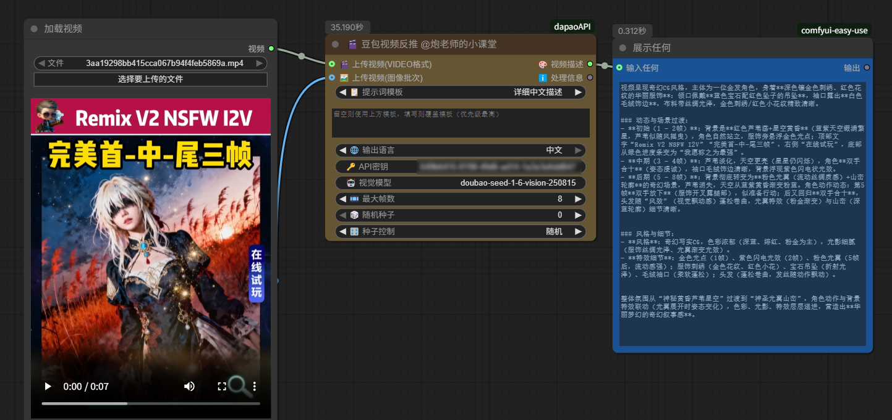

# 🤖 dapaoAPI - ComfyUI 多功能 API 节点集合

<div align="center">

**一套强大的 ComfyUI 自定义节点，集成多个主流 AI 服务 API**

[](https://opensource.org/licenses/MIT)
[](https://www.python.org/downloads/)
[](https://github.com/comfyanonymous/ComfyUI)

</div>

---

## 📖 项目简介

dapaoAPI 是一套为 ComfyUI 设计的高质量自定义节点集合，整合了 **火山引擎 Seedream 4.0**、**智谱 AI（GLM）** 和 **字节跳动豆包** 等主流 AI 服务，提供从图像生成、图像分析到文本处理的完整工作流支持。

### ✨ 核心特性

- 🎨 **图像生成**：Seedream 4.0 文生图 + 8种模式多图编辑
- 🎬 **视频生成**：Sora2 文生视频 + 图生视频，支持多种分辨率和时长
- 🔍 **图像分析**：GLM-4V / 豆包 Vision 多图联合智能反推提示词
- ✍️ **文本优化**：GLM-4 提示词智能润色与扩写
- 💬 **LLM 对话**：豆包/智谱双引擎智能对话系统
- 🎛️ **统一界面**：紫色主题，优雅易用
- ⚙️ **灵活配置**：种子控制、批量生成、自定义参数

---

## 📦 节点列表

| 节点名称 | 功能描述 | 核心特性 | 文档链接 |
|---------|---------|---------|---------|
| **Seedream 4.0 文生图** | 文本生成高质量图像 | 多风格预设、批量生成、种子控制 | [📖 使用说明](docs/1-Seedream文生图使用说明.md) |
| **Seedream 4.0 多图编辑** | 强大的多图编辑工具 | 8种编辑模式、最多8图输入、智能混合 | [📖 使用说明](docs/2-Seedream多图编辑使用说明.md) |
| **GLM 图像反推** | 图像内容智能分析 | 多图联合分析、多种输出格式 | [📖 使用说明](docs/3-GLM图像反推使用说明.md) |
| **GLM 提示词润色** | 提示词智能优化 | 3种预设方案、自定义指令 | [📖 使用说明](docs/4-GLM提示词润色使用说明.md) |
| **豆包 LLM 对话** | 字节跳动大语言模型 | 快速响应、通用对话 | [📖 使用说明](docs/5-豆包LLM对话使用说明.md) |
| **豆包图像反推** | 豆包 Vision 图像分析 | 多图联合分析、英文提示词生成 | [📖 使用说明](docs/7-豆包图像反推使用说明.md) |
| **智谱 LLM 对话** | 智谱 AI 大语言模型 | 深度中文理解、专业内容 | [📖 使用说明](docs/6-智谱LLM对话使用说明.md) |
| **豆包视频反推** | 豆包 Vision 视频内容分析 | VIDEO/图像批次双输入、4种模板、中英文切换 | [📖 使用说明](docs/8-豆包视频反推使用说明.md) |
| **Sora2 视频生成** | 文生视频 + 图生视频 | 多种分辨率、时长可调、高清模式 | 🆕 新增功能 |

---
## 效果演示
🚀 豆包4.0多图组合

🚀 豆包4.0文生图

🚀 其他功能（提示词润色 反推 大语言润色等）


🚀 豆包4.0视频反推

🚀 全系功能演示在示意工作流里面，节点安装后在examples文件夹


## 🚀 快速开始

### 环境要求

- **ComfyUI**：已安装并能正常运行
- **Python**：3.8 或更高版本
- **依赖库**：requests、zhipuai（自动安装）

### 安装方法

#### 方法一：ComfyUI Manager（推荐）

1. 打开 ComfyUI Manager
2. 搜索 "dapaoAPI"
3. 点击安装
4. 重启 ComfyUI

#### 方法二：Git 克隆

```bash
cd ComfyUI/custom_nodes/
git clone https://github.com/paolaoshi/ComfyUI-dapaoAPI.git
cd ComfyUI-dapaoAPI
pip install -r requirements.txt
```

#### 方法三：手动下载

1. 下载本项目的 ZIP 文件
2. 解压到 `ComfyUI/custom_nodes/ComfyUI-dapaoAPI`
3. 运行 `install.bat`（Windows）或 `pip install -r requirements.txt`


## 🔑 API 密钥获取

### Seedream 4.0（火山引擎）

1. 访问 [火山引擎控制台](https://console.volcengine.com/ark)
2. 创建 API Key
3. 创建推理端点并获取 Endpoint ID

**文档**：https://www.volcengine.com/docs/82379

### 智谱 AI

1. 访问 [智谱 AI 开放平台](https://open.bigmodel.cn/)
2. 注册并登录
3. 前往 [API Keys 页面](https://open.bigmodel.cn/usercenter/apikeys)
4. 创建并复制 API Key

**文档**：https://open.bigmodel.cn/dev/api

### 豆包（字节跳动）

1. 访问 [火山引擎豆包页面](https://console.volcengine.com/ark)
2. 开通豆包服务
3. 创建 API Key

**文档**：https://www.volcengine.com/docs/82379


#### 模型选择

| 模型 | 特点 | 推荐场景 |
|------|------|----------|
| **GLM-4.5-Flash** ⭐ | 速度最快，性价比高 | 日常使用 |
| **GLM-4-Plus** | 能力最强，深度理解 | 专业需求 |
| **GLM-4-Air** | 平衡版本 | 通用场景 |
| **GLM-4-Flash** | 快速响应 | 实时对话 |

#### 典型应用
- 学术论文写作
- 深度问题解答
- 数据分析报告
- 教学辅导
- 专业内容生成

[📖 查看完整文档](docs/6-智谱LLM对话使用说明.md)

---

## 🎨 统一界面主题

所有节点采用统一的紫色主题，易于识别和使用：

- 🎨 **标题栏颜色**：紫色（#631E77）
- 🎨 **节点背景**：橙棕色（#773508）
- 📁 **节点分类**：🤖dapaoAPI
- 💡 **设计理念**：简洁、优雅、专业


## 🙏 致谢

感谢以下服务提供商：
- [火山引擎](https://www.volcengine.com/) - Seedream 4.0 & 豆包
- [智谱AI](https://open.bigmodel.cn/) - GLM-4 系列模型
- [ComfyUI](https://github.com/comfyanonymous/ComfyUI) - 优秀的节点化AI工作流框架

---

## 📞 联系方式

- **作者**：@炮老师的小课堂
- **版本**：v1.0.1
- **更新日期**：2025年
- **作者微信**：paolaoshiAICG


---

## 🌟 支持项目

如果这个项目对您有帮助，请给个 ⭐ Star！

有任何问题或建议，欢迎提交 Issue 或 PR。

---

<div align="center">

**Happy Creating with dapaoAPI! 🎨✨**

</div>
